# Curso de Ingeniería de Datos con Python

- [Curso de Ingeniería de Datos con Python](#curso-de-ingenier%C3%ADa-de-datos-con-python)
  - [¿Qué es la Ciencia e Ingeniería de Datos?](#%C2%BFqu%C3%A9-es-la-ciencia-e-ingenier%C3%ADa-de-datos)
  - [Roles](#roles)
  - [Configuración del ambiente](#configuraci%C3%B3n-del-ambiente)
  - [Jupyter Notebook](#jupyter-notebook)
  - [Tipos de datos](#tipos-de-datos)
  - [Fuentes de datos](#fuentes-de-datos)
    - [Links de fuentes de datos](#links-de-fuentes-de-datos)
  - [ETL (Extract Transform Load)](#etl-extract-transform-load)
  - [Introducción a las tecnologías web](#introducci%C3%B3n-a-las-tecnolog%C3%ADas-web)
  - [Realizando solicitudes HTTP con Python](#realizando-solicitudes-http-con-python)
  - [¿Cómo trabajar con documentos HTML?](#%C2%BFc%C3%B3mo-trabajar-con-documentos-html)
  - [Solicitudes a la web: Requests](#solicitudes-a-la-web-requests)
  - [Implementando un web scrapper: Configuracion](#implementando-un-web-scrapper-configuracion)
  - [Introduccion a Pandas](#introduccion-a-pandas)
  - [Estructura de datos: Series](#estructura-de-datos-series)
  - [Estructura de datos: DataFrames](#estructura-de-datos-dataframes)
  - [Indices y seleccion](#indices-y-seleccion)
    - [Reading data examples](#reading-data-examples)
    - [Dictionary like examples](#dictionary-like-examples)
    - [Numpy like examples](#numpy-like-examples)
    - [Label based examples](#label-based-examples)
  - [Data wrangling con Pandas](#data-wrangling-con-pandas)
  - [¿Cómo trabajar con datos faltantes?](#%C2%BFc%C3%B3mo-trabajar-con-datos-faltantes)
  - [Limpiando detalles adicionales](#limpiando-detalles-adicionales)
  - [Enriquecimiento de los datos](#enriquecimiento-de-los-datos)
  - [Valores duplicados](#valores-duplicados)
  - [Introducción a los sistemas de datos](#introducci%C3%B3n-a-los-sistemas-de-datos)
    - [SQL vs NoSQL](#sql-vs-nosql)

## ¿Qué es la Ciencia e Ingeniería de Datos?

La _Ciencia de Datos_ es la disciplina que se encarga de _extraer conocimiento de los datos disponibles_. Casi siempre cuando te realizas una pregunta sobre datos estas fuentes se encuentra escondidas, ocultas o de difícil acceso. A nuestro alrededor hay datos en tu computadora, mesa, reloj, etc.

> Los datos están por todas partes.

La Ciencia de datos es _multidisciplinaria_. A diferencia de muchos otros ámbitos profesionales dentro del mundo de la tecnología, cuando hablamos de un científico de datos es una persona que sabe de matemáticas, ingeniería de software y sabe de negocios.

Se apoya en la _Computer science_, _Matemáticas_(Regresiones e Inferencias),

También se auxilia de:

- Bases de Datos
  - SQL y NoSQL
- Análisis de texto y procesamiento de lenguaje natural
- Análisis de redes
- Visualización de datos
- Machine learning e Inteligencia Artificial
- Análisis de señales digitales
- Análisis de datos en la nube(Big Data)

## Roles

Existen por lo menos tres diferentes roles para tener un _pipeline_ completo de ciencia de datos. Este curso trata sobre el primer rol:

- __Data engineer__
  - Se encarga de obtener los datos
  - Limpiarlos y estructurarlos para posterior análisis
  - Crear pipelines de análisis automatizado
  - Utilización de herramientas en la nube
  - Análisis descriptivo de los datos.

- __Data scientist__
  - Una vez tiene los datos se encarga de generar el análisis matemático de ellos
  - Encuentra las relaciones entre las variables, las correlaciones, las causas
  - Genera los modelos predictivos y prescriptivos.

- __Machine Learning engineer__
  - Se encarga de llevar las predicciones a escala
  - Subirlos a la nube
  - En la nube, generar muchas predicciones
  - Se encarga de mantener la calidad del modelo.

## Configuración del ambiente

_Anaconda_ es una instalación de _Python_ que ya trae preinstalado todos los paquetes necesarios para tu labor en la Ciencia de Datos, tiene más de 1400 paquetes. Nos permite configurar ambientes virtuales para poder utilizar diferentes versiones de nuestros paquetes.

```bash
conda --version # para conocer la versión y saber que lo tenemos instalado
conda --help # nos da todos los comandos que podemos usar.
conda list # nos lista todos los paquetes que Anaconda instaló.
```

Una buena práctica es generar un ambiente virtual por cada proyecto, los ambientes virtuales nos permiten generar varios proyectos con diferentes versiones de la librería sin generarnos errores de compatibilidad. Tradicionalmente en Python se utiliza `virtualenv`.

```bash
conda create --name [nombre-del-proyecto] [librerías-a-usar]
conda create --name platzi-data beautifulsoup4 requests numpy pandas matplotlib yaml
```

```bash
source activate platzi-data # Para activar
source deactivate # Para salir

conda env list # nos muestra los ambientes virtuales que tenemos
conda remove --name [nombre-del-proyecto] --all # eliminar nuestro entorno virtual con todos nuestros paquetes
```

## Jupyter Notebook

Algo interesante que tenemos con _Anaconda_ es que nos trae _Jupyter Notebooks_.

Jupyter Notebooks es un __entorno de programación__ en el cual podemos mezclar ejecución de _código en vivo_, _visualizaciones_ y añadir _markdown_.

Para inicializar nuestro servidor de jupyter, escribimos en el command line: `jupyter notebook`.

Jupyter Notebook tiene diferentes tipos de celdas en las cuales podemos escribir código o markdown. Si queremos ejecutar nuestro código hacemos `ctrl + enter` y si queremos ejecutar y añadir una nueva celda `shift + enter`.

Jupyter Notebook tiene dos modalidades, la modalidad de __edición__ y __navegación__.

## Tipos de datos

Los datos vienen en mucha formas y estas formas las podemos clasificar de diferentes maneras, permitiéndonos poder aplicar técnicas distintas a cada uno de los tipos de datos.

Los primeros datos son los primitivos.

- int,
- str,
- bool,
- float,
- hex,
- oct,
- datetime,
- objetos especiales

```python
from datetime import datetime

integer_type = 42
float_type = 3.14159
bool_type = False
hex_type = 0xff
oct_type = 0o23
today = datetime.now()
str_type = 'Jesus'
```

Tenemos clasificaciones ulteriores como:

- Los datos estructurados: son los más fáciles de acceder
  - Bases de datos
  - Data warehouses


- Semi estructurados: son con los que podemos utilizar APIs
  - json API
  - Datos tabulares (csv, excel)
- no estructurados: la mayoría de datos que vamos a tener disponibles están clasificados aquí
  - HTML
  - Texto libre
  - Currículums vitae
  - Imágenes, audio, social media
  - Datos científicos


- Cualitativos vs cuantitativos
- Tiempo real vs históricos

## Fuentes de datos

- __Web__

Es una mina enorme con datos financieros, de startups, del clima, precipitación fluvial, astronómicos, de negocios, etc.

- __APIs__

Endpoints que viven en la web y nos devuelven JSON. Por ejemplo, la API de twitter, google, facebook.

- __User Analytics__

Son el comportamiento del usuario dentro de nuestra aplicaciones, algo similiar a los que nos ofrece Google Analytics.

- __IoT__

Se ha vuelto una mina espectacular en los últimos años. Como automóviles.

### Links de fuentes de datos

- [El Pais](https://elpais.com/elpais/portada_america.html)
- [Google Cloud Platform](https://console.cloud.google.com/apis/library)
- [Datos Abiertos de México](https://datos.gob.mx/)
- [Dataset Search by Google](https://toolbox.google.com/datasetsearch)
- [Data Catalog for Analysis](https://data.world/)
- [Kaggle, for Data Science](https://www.kaggle.com/)

## ETL (Extract Transform Load)

__Extract__: Es el proceso de lectura de datos de diversas fuentes

- Base de datos
- CRM
- Archivos CSV
- Datasets públicos

__Transform__: En este momento cuando nosotros tenemos que transformar los datos, tenemos que identificar datos faltantes o datos erróneos o una edad negativa. En esta etapa donde tenemos que identificar todos los problemas y solucionarlos.

- Limpieza
- Estructurado
- Enriquecimiento.

__Load__: Una vez transformados debemos insertarlos en el data warehouse

- Depende del tipo de solución que se haya escogido

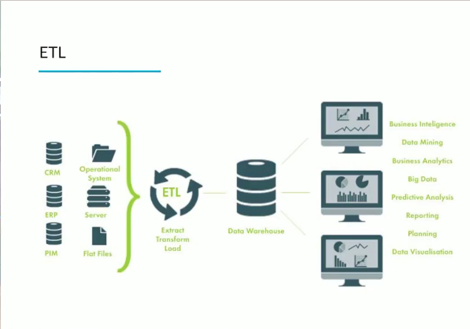

## Introducción a las tecnologías web

Las tecnologías web en principio podemos pensarlas como el internet, pero el internet es mucho más grande, es la _red de redes_, la forma en la que millones de computadores se conectan entre ellas para _transferirse información_.

El internet también se compone de otros pedazos como:

- Telefonía(voip),
- Mail(pop3, imap),
- Compartir archivos(ftp).

El internet es una red que une varias redes públicas, privadas, académicas, de negocios, de gobiernos, etc.

La web específicamente es un espacio de información en el cual varios documentos(y otros recursos web) se pueden acceder a través de URLs y vínculos(links). La comunicación se da a través del protocolo HTTP.

Elementos básicos de la web:

- __HTML__: nos da la estructura de la información. Es un lenguaje para anotar pedazos de información para que el navegador o otros tipos de programa puedan interpretar que tipo de información se encuentra ahí.
- __CSS__: nos permite darle colores, arreglar el texto y añadir diferentes elementos de presentación.
- __Javascript__: nos permite añadir interactividad y cómputo a nuestra web.
- __JSON__: Simplemente es una forma de transmitir datos entre servidores y clientes. Es la forma estándar en las que en la web y las aplicaciones se comunican con los servidores backend.

Un link interesante para los sitios SPA, sería [Puppeteer](https://developers.google.com/web/tools/puppeteer/), ya que al ser rendereado por JavaScript, nuestro `scrapping` a veces puede que nos traiga sitios "vacíos".

## Realizando solicitudes HTTP con Python

Para poder experimentar con la web necesitamos un método programático para solicitar _URLs_ y obtener _HTML_.

__Requests__: Nos permite generar solicitudes a la web dentro de Python y utilizar los diferentes verbos `HTTP`, normalmente utilizaremos el método `GET` porque vamos a traer datos.

Algunos ejemplos de verbos HTTP:

- GET
- POST
- PUT
- DELETE
- PATCH
- OPTIONS

```bash
requests.get('url') # para hacer una solicitud a la web y nos devolverá un objeto response
```

Todas las solicitudes _HTTP_ tienen _metadatos_ para que los diferentes sistemas y computadoras puedan entender de qué va la solicitud.

Algunos de los códigos de estado del protocolo HTTP:

- 200 : OK - Petición correcta.
- 400 : Bad request - Petición incorrecta.
- 404 : Not found - Recurso no encontrado.

Estos códigos estan categorizados en los siguientes grupos:

- 1xx : Respuestas informativas (Ej: 100, 101, 102, etc.)
- 2xx : Peticiones correctas (Ej: 200, 201, 202, etc.)
- 3xx : Redirecciones (Ej: 300, 301, 302, etc.)
- 4xx : Errores en el lado del cliente (Ej: 400, 401, 402, etc.)
- 5xx : Errores en el lado del servidor (Ej: 500, 501, 502, etc.)

Puedes ver la lista en este [link](https://es.wikipedia.org/wiki/Anexo:C%C3%B3digos_de_estado_HTTP)

Un ejemplo del uso de una librería de Python llamada `requests`:

```python
import requests

response = requests.get('https://platzi.com')

response? # Nos da una respuesta con información mínima del tipo de contenido
response?? # Nos extiende la respuesta de la clase con su contenido

print(dir(response)) # Nos da todos los métodos que podemos usar en response

# ['__attrs__', '__bool__', '__class__', '__delattr__', '__dict__', '__dir__', '__doc__', '__enter__', '__eq__', '__exit__', '__format__', '__ge__', '__getattribute__', '__getstate__', '__gt__', '__hash__', '__init__', '__init_subclass__', '__iter__', '__le__', '__lt__', '__module__', '__ne__', '__new__', '__nonzero__', '__reduce__', '__reduce_ex__', '__repr__', '__setattr__', '__setstate__', '__sizeof__', '__str__', '__subclasshook__', '__weakref__', '_content', '_content_consumed', '_next', 'apparent_encoding', 'close', 'connection', 'content', 'cookies', 'elapsed', 'encoding', 'headers', 'history', 'is_permanent_redirect', 'is_redirect', 'iter_content', 'iter_lines', 'json', 'links', 'next', 'ok', 'raise_for_status', 'raw', 'reason', 'request', 'status_code', 'text', 'url']

print(response.status_code) # Nos devuelve el status code (en este caso 200)

print(response.headers) # Nos devuelve los headers de la página

# {'Date': 'Tue, 06 Nov 2018 17:04:21 GMT', 'Content-Type': 'text/html; charset=utf-8', 'Transfer-Encoding': 'chunked', 'Connection': 'keep-alive', 'Set-Cookie': '__cfduid=d1b51196c1cf6dbe852e2ab7c341fd1761541523860; expires=Wed, 06-Nov-19 17:04:20 GMT; path=/; domain=.platzi.com; HttpOnly, entry_path="/"; expires=Tue, 06-Nov-2018 17:54:21 GMT; Max-Age=3000; Path=/, s=s723u4hzyyae5eij27jr2qhaivflws65; Domain=.platzi.com; expires=Tue, 20-Nov-2018 17:04:21 GMT; HttpOnly; Max-Age=1209600; Path=/; Secure, csrftoken=KH1rPdE3CzxwYgrlUQsV4yoAQIoVQmVPgOTo3AHGrEsmW5OldBBGMegvJw6UI6d1; expires=Tue, 05-Nov-2019 17:04:21 GMT; Max-Age=31449600; Path=/', 'Content-Language': 'es', 'strict-transport-security': 'max-age=86400; includeSubDomains', 'Vary': 'Accept-Encoding, Accept-Language, Cookie', 'x-content-type-options': 'nosniff', 'X-Frame-Options': 'SAMEORIGIN', 'x-xss-protection': '1; mode=block', 'Expect-CT': 'max-age=604800, report-uri="https://report-uri.cloudflare.com/cdn-cgi/beacon/expect-ct"', 'Server': 'cloudflare', 'CF-RAY': '47592380fe671ffa-DFW', 'Content-Encoding': 'gzip'}

print(response.headers['Date']) # Al ser la respuesta de los headers un diccionario, podemos acceder a su información particular

# Tue, 06 Nov 2018 17:04:21 GMT

print(response.text) # Nos devuelve el contenido html del sitio
```

## ¿Cómo trabajar con documentos HTML?

En el caso de Python la librería estándar para manipular los documentos _HTML_ se llama __BeautifulSoup__.

_BeautifulSoup_ nos ayuda a organizar _gramaticalmente_(parsear) el documento HTML para que tengamos una estructura con la cual podamos manejar y extraer información. BeautifulSoup convierte el string de HTML en un árbol de nodos para poder manipularlo.

Para manipularlo podemos usar los selectores _CSS_ con `soup.select()`

Por ejemplo:

```python
soup = bs4.BeautifulSoup(response.text, 'html.parser')
soup.select('body')
```

Un ejemplo del uso de BeautifulSoup para obtener los links de todas las carreras del Sitio Web de Platzi:

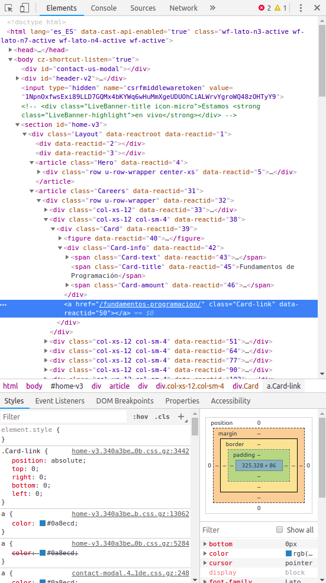

```python
import bs4

soup = bs4.BeautifulSoup(response.text, 'html.parser')

# print(soup.title.text) # Nos devuelve el título del Sitio web según su title en el DOCTYPE de HTML

# print(soup.select('meta[name=description]')) # Nos devuelve la lista del contenido de meta

# print(soup.select('meta[name=description]')[0]['content']) # Nos devuelve únicamente el content que hay en meta

courses_links = soup.select('.Card-link')
courses = [course['href'] for course in courses_links]

for course in courses:
    print(course) # Nos devuelve toda la lista de href de cada carrera de Platzi
```

## Solicitudes a la web: Requests

Para poder desarrollar scrapers debemos entender los datos _semi estructurados_ dados por el HTML para determinar __qué tipo__ de selectores CSS necesitamos para sacar información.

Un buen __Data engineer__ utiliza los conceptos de la ingeniería de software para poder desarrollar sus programa. En nuestro caso para poder desarrollar, nos apoyaremos de un _patrón_.

__Page Object Patter__: Es un patrón que consiste en 'esconder' los queries especificos que se utilizan para manipular un documento HTML detrás de un objeto que representa la página web.

Si estos queries se añaden directamente al código principal, el código se vuelve frágil y va a depender mucho de la modificación que hagan a la web otras personas y arreglarlo se vuelve muy complicado.

Por ejemplo:

```python
class WebPage:
    ...

    @property
    def page_header(self):
        return soup.select('some-query h1')
```

## Implementando un web scrapper: Configuracion

Nos posicionamos en la carpeta contenedora de nuestro proyecto y corremos la app con el siguiente comando:

```bash
python main.py eluniversal
# o con el siguiente comando
python main.py elpais
```

## Introduccion a Pandas

Pandas nos otorga diversa facilidades para el "_domados de datos_”. Nos otorga dos estructura de datos:

- __Series__: Es un array unidimensional que representa una columna.
- __DataFrame__: Es un conjunto de series que forman una tabla. Se pueden acceder a través de indices como un etiqueta(label) o pueden ser posicionales es decir 0 o indice 100. También pueden ser rangos o slices. Son muy similares a una hoja de cálculo o una tabla de base de datos.

Estas estructuras de datos _no son contenedores de datos_. En Pandas tenemos estructuras intermedias y las utilizamos para:

- Transformar y enriquecer nuestros datos
- Manipularlos
- Manejar los faltantes
- Realizar operaciones aritméticas
- Combinar diferentes dataframes en uno solo para obtener una nueva tabla

Pandas también nos da facilidades para leer datos de disco y escribirlos rápidamente.

## Estructura de datos: Series

Series es un _vector unidimensional_ (recordemos que los vectores debemos verlos como una lista), para poder acceder a esta lista podemos usar _posiciones_ o _labels_, siendo este último el preferido para manipular las series. Una diferencia importante sobre las _listas_ de Python es que _los datos son homogéneos_, es decir solo podemos tener un tipo de dato por cada Serie.

Las Series se pueden crear a partir de cualquier secuencia(listas, tuplas, arrays de numpy y diccionarios).

Por ejemplo:

```python
series = pd.Series([1, 2, 3])
```

En Python tenemos la filosofía del __Duck Typing__ (si se ve como un pato y hace cuac, a ese animal le llamamos pato), si una serie se comporta como una lista, se accede como una lista, en principio deberíamos llamarla lista, pero esto no es así.

Una __mejor aproximación__ para inicializar Series es utilizar diccionarios.

Por ejemplo:

```python
import pandas as pd # This pd is a convention in the Data Science with Python

series_test = pd.Series([100, 200, 300])

series_test
# 0    100
# 1    200
# 2    300
# dtype: int64

series_test2 = pd.Series({
    1999: 48,
    2000: 65,
    2001: 89
}, dtype=float)

series_test2
# 1999    48.0
# 2000    65.0
# 2001    89.0
# dtype: float64
```

## Estructura de datos: DataFrames

DataFrames son simplemente una _tabla_ donde las filas y las columnas _tienen etiquetas_, se puede construir de diferentes formas pero siempre debemos considerar que __la estructura que necesitamos construir para inicializarla tiene que ser bidimensional__. Una matriz y puede ser una lista de listas, lista de tuplas, un diccionario de Python u otro DataFrame.

Si solo tenemos una dimensión a eso no le llamamos DataFrame, le llamamos Serie. Cuando utilizamos un diccionario las llaves se convierten en las llaves de la columna.

Por ejemplo:

```python
frame_test = pd.DataFrame({
    1999: [74, 38, 39],
    2000: [34, 32, 32],
    2001: [23, 39, 23]
})

frame_test
# Devuelve una tabla con títulos en las columnas (1999, 2000, 2001) e índices en las filas (0, 1, 2)
```

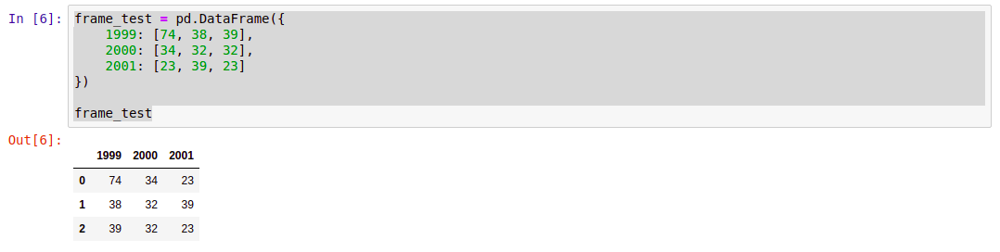

```python
frame_test2 = pd.DataFrame([
    [74, 38, 39],
    [34, 32, 32],
    [23, 39, 23]
])

frame_test2
# Devuelve una tabla con títulos insertados automáticamente en las columnas (0, 1, 2) e índices en las filas (0, 1, 2)
```

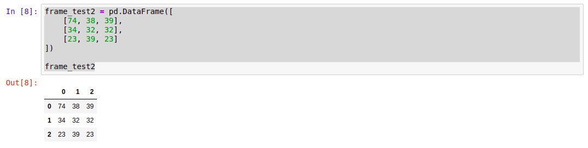

```python
frame_test3 = pd.DataFrame([
    [74, 38, 39],
    [34, 32, 32],
    [23, 39, 23]
], columns=[1999, 2000, 2001])

frame_test3
# Devuelve una tabla como en el primer ejemplo, ya que agregamos el keyword columns con el nombre de las columnas
```

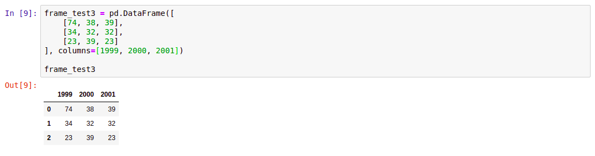

## Indices y seleccion

Existen muchas formas de manipular los DataFrames y de seleccionar los elementos que queremos transformar.

__Dictionary like__:

```python
df[col1] # Regresa un DataSeries
df[['col1', 'col3']] # Regresa un DataFrame
```

__Numpy like__:

```python
# iloc = index location
df.iloc[:] # fila
df.iloc[:,:] # fila, columna
```

__Label based__:

```python
# loc = location
df.loc[:] # fila
df.loc[:,:] # fila, columna
```

Existe una gran diferencia en la forma en la que utilizamos estos `slices` porque varía de la forma tradicional de Python. `loc` va a incluir el final del que necesitamos, osea, es incluyente con los extremos.

### Reading data examples

```python
pd.options.display.max_rows = 10 # Nos muestra 10 filas (las 5 primeras y las 5 últimas)

el_universal = pd.read_csv('web_scrapper_curso_data_eng/eluniversal_2018_11_07_articles.csv')

type(el_universal)

el_universal

# el_universal.head() # Nos muestra los primeros 5 datos

# el_universal.tail() # Nos muestra los últimos 5 datos
```

### Dictionary like examples

```python
el_universal['title'] # Devuelve todo, pero solo la columna title
el_universal[['title', 'url']] # Devuelve todo, pero solo las columnas title y url
```


### Numpy like examples

```python
el_universal.iloc[10:15] # Nos devuelve el rango sin incluir los valores extremos del rango
el_universal.iloc[66]['title'] # Devuelve de la fila 66 solamente el title
el_universal.iloc[:5, 0] # Devuelve del inicio a la fila 5, solamente la columna 0 (no es común ni ideal acceder de este modo)
```

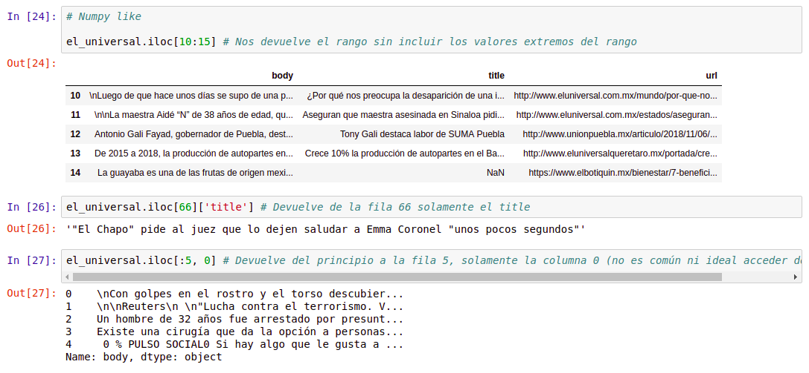

### Label based examples

```python
el_universal.loc[:, 'body':'title'] # Devuelve del principio al final solo body y title (incluyendo los valores extremos)
```

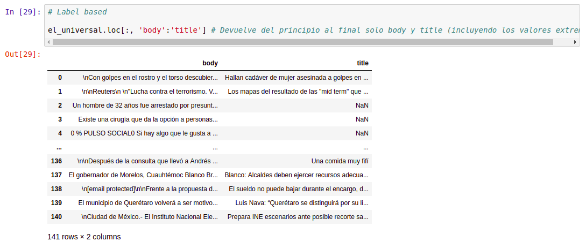

## Data wrangling con Pandas

Data wrangling es una de las actividades más importantes de todos los profesionales de datos. Simplemente es _limpiar, transformar y enriquecer el dataset_ para objetivos posteriores.

Por ejemplo:

- Inserción en una base de datos
- Visualización

_Pandas_ es una de las herramientas más poderosas para realizar este “_domado_” de datos. Recordemos que Pandas trae muchas de sus abstracciones del lenguaje __R__, pero nos otorga lo mejor de ambos mundos, por eso es tan popular.

Nos permite:

- Generar transformaciones con gran facilidad
- Trabajar rápidamente con datasets grandes
- Detectar y reemplazar faltantes
- Agrupar y resumir nuestros datos
- Visualizar nuestros resultados

Por ejemplo:

```python
# 1. Vamos a añadir la columna newspaper_uid al DataFrame, con el nombre eluniversal
el_universal['newspaper_uid'] = 'eluniversal'

el_universal # Nos devuelve el DataFrame con todos los valores y la nueva columna newspaper_uid
```

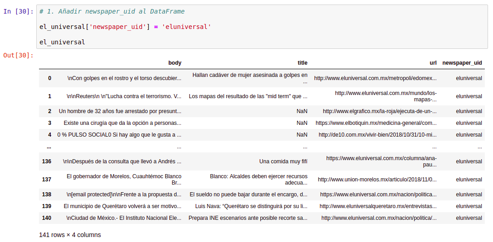

```python
# 2. Vamos a Obtener el host e incluirlo como una nueva columna
from urllib.parse import urlparse
# El módulo urllib.parse define una interfaz estandar para romper URLs en strings
# https://docs.python.org/3/library/urllib.parse.html

el_universal['host'] = el_universal['url'].apply(lambda url: urlparse(url).netloc)
# La sintaxis de lambda nos permite poner una función inline
# netloc nos devuelve el host dentro de la librería urlparse

el_universal
```

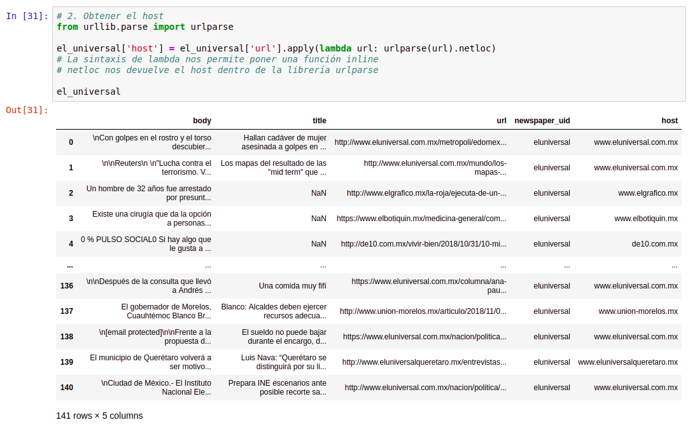

```python
# Vamos a obtener los diferentes hosts que trae nuestro DataFrame
el_universal['host'].value_counts()
# La función value_counts() nos permite contar cuantos valores se repiten y sus frecuencias
```

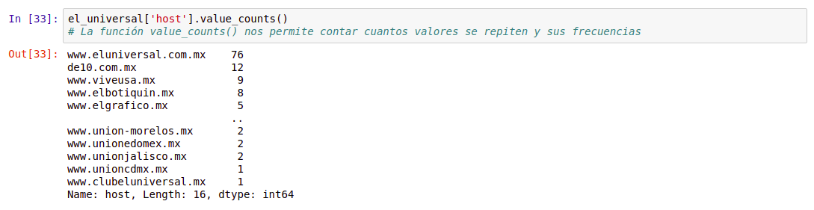

## ¿Cómo trabajar con datos faltantes?

Los datos faltantes representan un verdadero problema sobre todo cuando estamos realizando _agregaciones_. Imagina que tenemos datos faltantes y los _llenamos con 0_, pero eso haría que la distribución de datos se modificara radicalmente. Podemos _eliminar los registros_, pero la fuerza de nuestras conclusiones se debilita.

_Pandas_ nos otorga varias funcionalidades para identificarlas y para trabajar con ellas. Existe el concepto que se llama `NaN`, cuando existe un dato faltante simplemente se rellena con un NaN y en ese momento podemos preguntar cuáles son los datos faltantes con:

- `.isna()` para preguntar dónde hay datos faltantes
- `notna()` para preguntar dónde hay datos completos.
- `dropna()` para eliminar el registro.

Para reemplazar:

- `fillna()` donde le damos un dato centinela
- `ffill()` donde utiliza el último valor.

Podemos ver más de estos conceptos en el link [Pandas Conversion](https://pandas.pydata.org/pandas-docs/stable/api.html#id2)

Por ejemplo:

```python
# 3. Vamos a rellenar los datos (titles) faltantes
missing_title_mask = el_universal['title'].isna()

# missing_title_mask

miss = el_universal[missing_title_mask]['url']

miss? # este método ? nos devuelve los valores que existen en el DataFrame
```

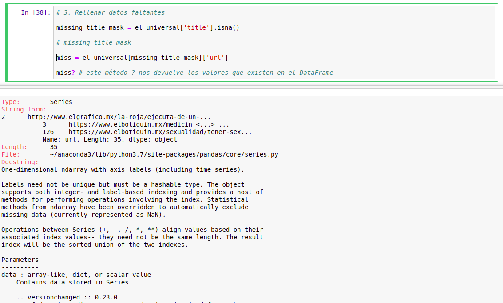

```python
missing_titles = (el_universal[missing_title_mask]['url']
     .str.extract(r'(?P<missing_titles>[^/]+)$')
     .applymap(lambda title: title.split('-'))
     .applymap(lambda title_word_list: ' '.join(title_word_list))
)
# usamos una regexp, donde ?P<> nos ayuda a nombrarla
# encerramos todo entre paréntesis, porque en Python, los espacios en blanco no importan
# applymap nos permite generar un mapa de una valor a otro, es decir una transformación
# con el primer applymap, dividimos el title por cada uno de los guiones medios
# con el segundo applymap, unimos todas las palabras, separándolas con un espacio en blanco

missing_titles
```

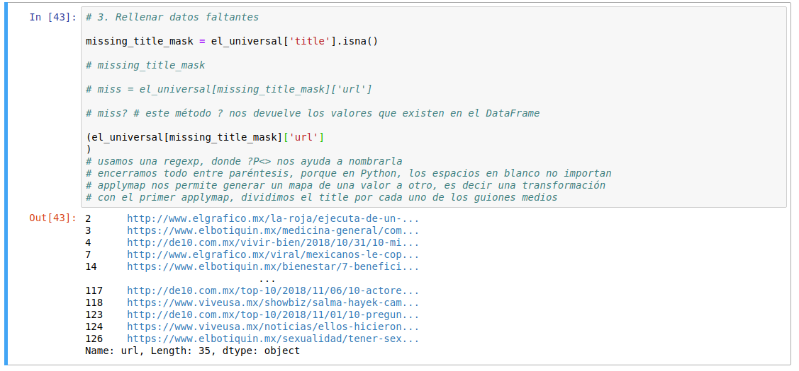

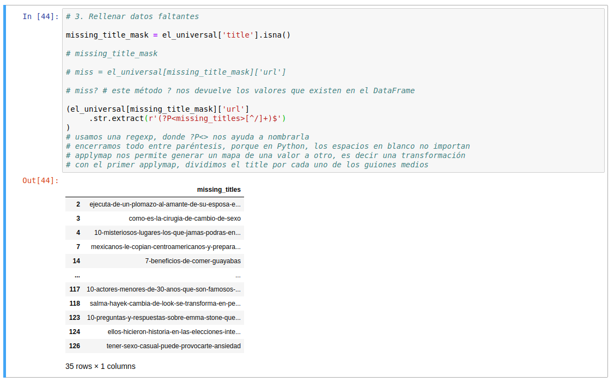

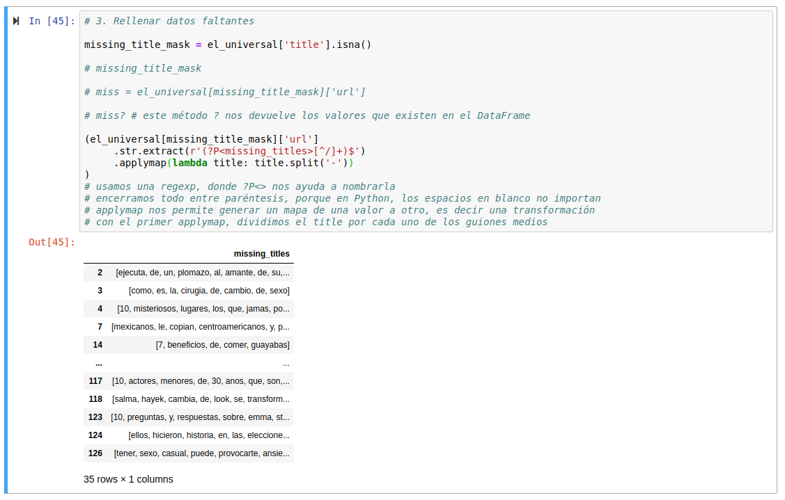

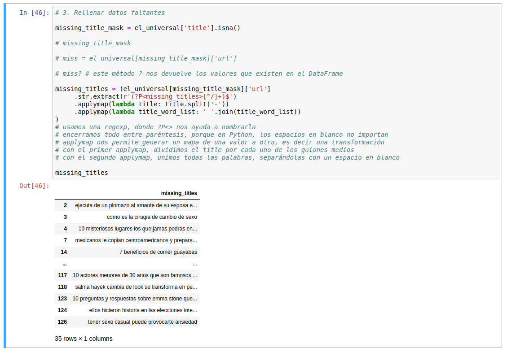

## Limpiando detalles adicionales

```python
# 4. Añadir uids a las filas
import hashlib # la librería hashlib nos ayuda a generar un has único de la url

uids = (el_universal
    .apply(lambda row: hashlib.md5(bytes(row['url'].encode())), axis=1)
    .apply(lambda hash_object: hash_object.hexdigest())
)

# el segundo parámetro de apply es el eje, en este caso 1 es filas y 0 columnas
# hashlib.md5 no es recomendable usarla para criptografía, ya que está comprobado que tiene problemas criptográficos
# pero nos va a devolver en este caso un número de 128 bits, que lo queremos representar de manera hexadecimal
# recibe un array de bytes, el cual construimos con un string, que lo sacamos de la url
# y lo codificamos en utf-8 con encode() -> sin parámetros por default tiene utf-8
# ya que tenemos nuestro objeto de hash, lo convertimos a una representación hexadecimal
# hash_object es lo que nos está regresando la primera función

el_universal['uid'] = uids # lo añadimos a una columna
el_universal.set_index('uid', inplace=True)
# definimos que esta columna sea nuestro índice (en vez de 0, 1, 2, ...; vamos a tener un uid único)
# en el primer parámetro de set_index le decimos el nombre de la columna que queremos como uid
# el segundo parámetro inplace significa que queremos modificar directamente nuestra tabla

el_universal
```

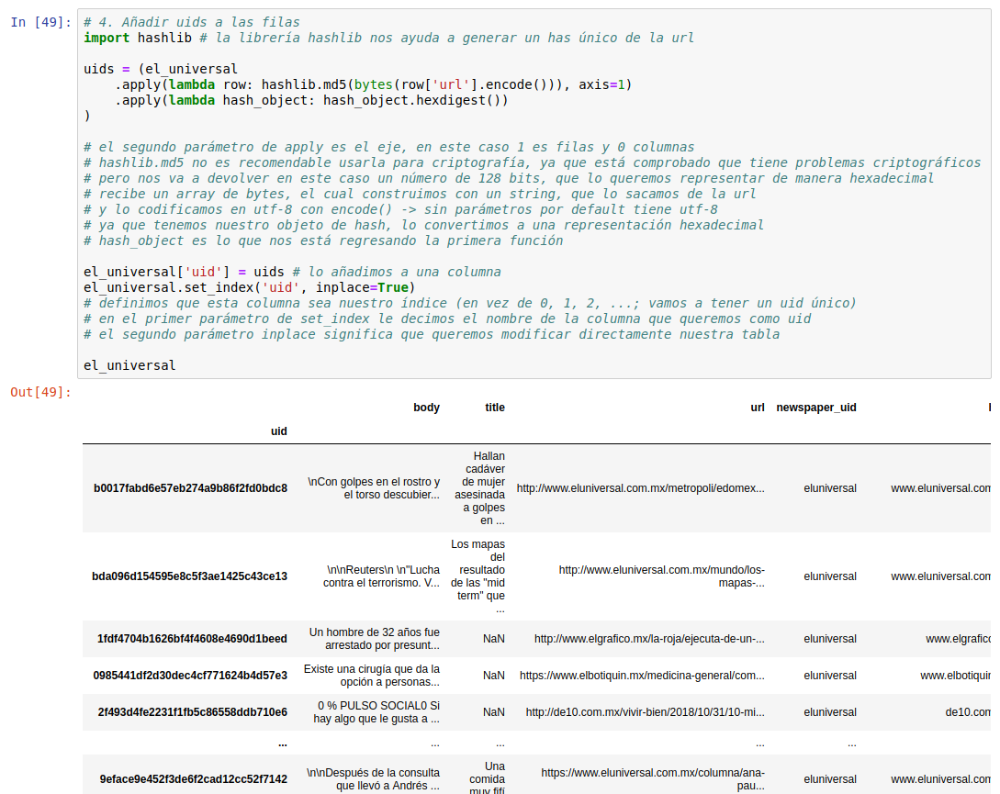

```python
stripped_body = (el_universal
    .apply(lambda row: row['body'], axis=1) # obtenemos la columna body del DataFrame
    .apply(lambda body: list(body)) # convertimos el body en una lista de letras
    .apply(lambda letters: list(map(lambda letter: letter.replace('\n', ''), letters))) # iteramos entre cada letra y cambiamos /n por ''. Convertimos el objeto map en objeto lista, envolviéndolo en list()
    .apply(lambda letters_list: ''.join(letters_list)) # vamos a unir de nuevo la lista
)

stripped_body
```

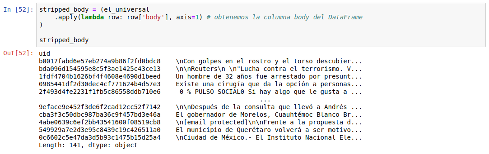

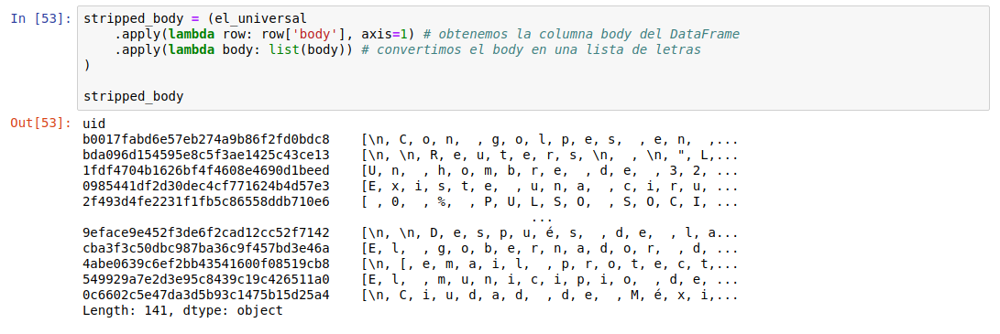

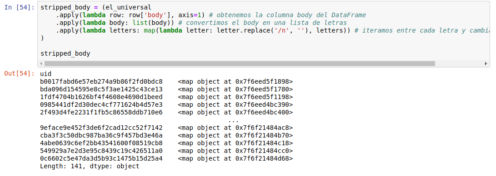

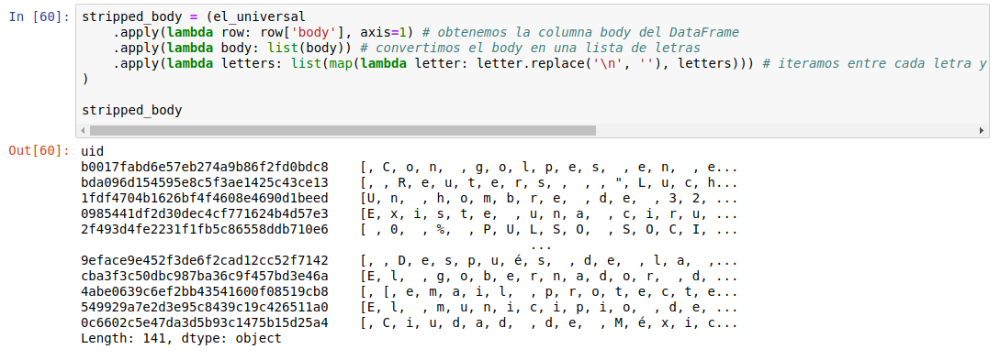

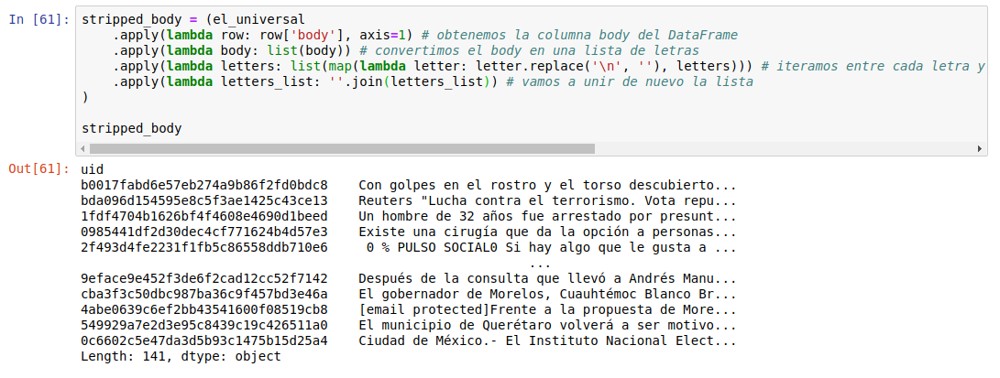

## Enriquecimiento de los datos

Podemos enriquecer nuestra tabla con información adicional, un poco de información numérica para realizar análisis posterior.

Usaremos `nltk` es una librería dentro del _stack_ de __Ciencia de Datos__ de Python que nos va a permitir tokenizar, separar palabras dentro del título y nos permitirá contar la frecuencia de cuántas palabras existen en nuestro título y body.

Por ejemplo:

```python
# 6. Tokenizar el title y body
import nltk
from nltk.corpus import stopwords # los stopwords no nos añaden valor al análisis ulterior (la, los, nos, etc.)

# en caso que sea la primera vez corriendo nltk
# en el intérprete de python3 descarga las siguientes librerías con los comandos:
# nltk.download('punkt')
# nltk.download('stopwords')

stop_words = set(stopwords.words('spanish'))

def tokenize_column(df, column_name):
    return (df
        .dropna() # eliminamos los NaN en caso que aún los haya
        .apply(lambda row: nltk.word_tokenize(row[column_name]), axis=1) # tokenizamos nuestra columna
        .apply(lambda tokens: list(filter(lambda token: token.isalpha(), tokens))) # eliminamos todas las palabras que no sean alfanuméricas
        .apply(lambda tokens_list: list(map(lambda token: token.lower(), tokens_list))) # convertir tokens a lower_case para compararlas correctamente con stopwords
        .apply(lambda word_list: list(filter(lambda word: word not in stop_words, word_list))) # eliminar palabras dentro de stopwords
        .apply(lambda valid_word_list: len(valid_word_list)) # obtenemos cuántas palabras son
    )

el_universal['n_tokens_title'] = tokenize_column(el_universal, 'title')
el_universal['n_tokens_body'] = tokenize_column(el_universal, 'body')

el_universal
```

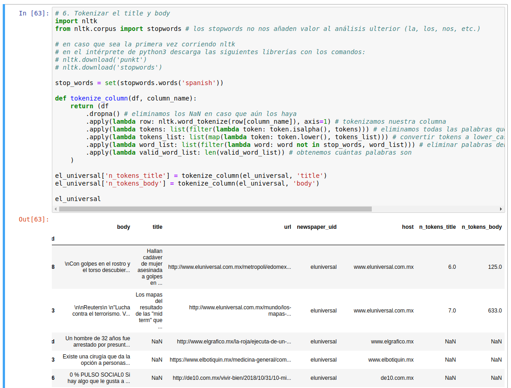

## Valores duplicados

Estos valores duplicados es importantes identificarlos y removerlos de nuestro datasets para que esos valores no generen un peso no justificado dentro del análisis a realizar dentro de nuestro Pipelines.

Pandas nos otorga la función `drop_duplicates` para eliminar estos valores duplicados.

Ejemplo:

```python
# 7. Vamos a eliminar duplicados

el_universal['title'].value_counts() # buscamos el número de veces que hay valores en la columna
el_universal[el_universal['title'] == 'Demócratas arrebatan Cámara Baja a Trump'] # máscara booleana para ver las veces que aparece el valor dado

el_universal.drop_duplicates(subset=['title'], keep='first', inplace=True) # eliminamos duplicados y mantenemos el primero
```

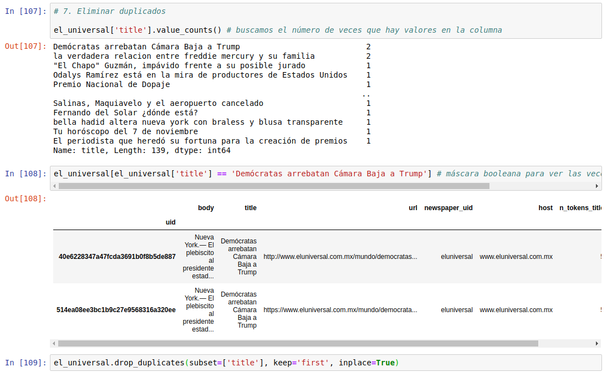

## Introducción a los sistemas de datos

Los sistemas de datos vienen en muchos sabores y colores, _SQL_, _NoSQL_, especializados en _procesamiento en bloque, chorro y streaming_. Este tipo de sistema nos permite realizar queries sofisticadas y compartir nuestro trabajo con otros miembros del equipo.

- __Procesamiento de bloque__: Estamos hablando de _datos históricos_, qué sucedió ayer, en el trimestre pasado, cuáles fueron las ventas del año anterior o de los últimos cinco años. Nos permite realizar el procesamiento de manera eficiente.

- __Procesamiento en chorro__: Significa que estamos _procesando los datos conforme van llegando_, las transformaciones se realizan en tiempo real. Este tipo de sistema nos sirven para cuando queremos realizar decisiones en donde la importancia del tiempo es fundamental.

El criterio principal a tener en cuenta: El tiempo que tienes. Si bien los sistemas open source son gratis, para poderlos implementar necesitas tener conocimientos de cloud, debes poder saber trabajar y mantener máquinas.

### SQL vs NoSQL

- SQL vs NoSQL describe las ventajas y desventajas de diversas aproximaciones a sistemas de datos.
- La discusión más relevante en el mundo de las aplicaciones web y móvil, donde dependiendo de la aplicación, la decisión puede ser fundamental para el crecimiento de la app.
- La verdad es que para los profesionales de los datos, especialmente los profesionales de los datos. Es necesario saber ambos.
